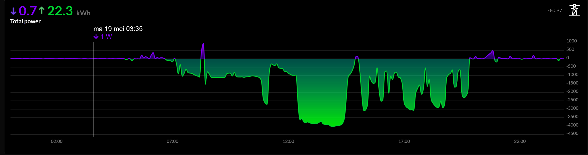
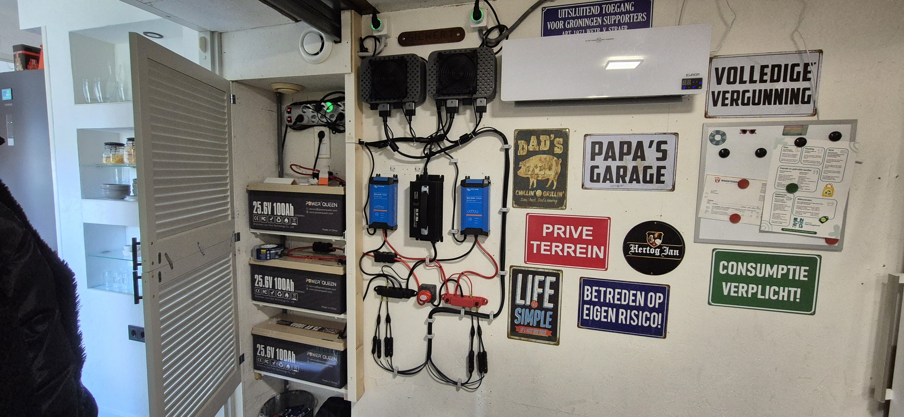
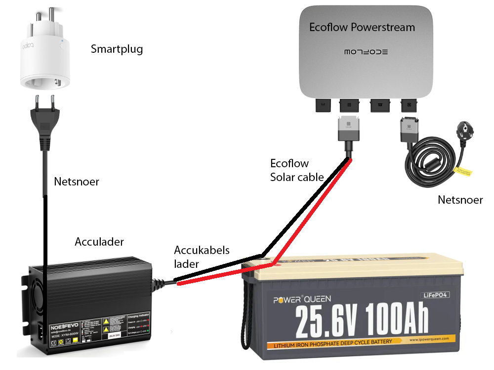

# PiBattery – Eenvoudige Zelfbouw Thuisbatterij

**PiBattery**  
Er is niets zo veranderlijk als de energiemarkt, en Den Haag is nog wispelturiger dan het Nederlandse weer.  
Met het naderende einde van de salderingsregeling en de invoering van terugleverkosten zocht ik naar een betaalbare oplossing om mijn energiekosten te drukken.  
Door de stijgende kosten en de maatregelen van overheid en energiebedrijven wordt thuis energie opslaan steeds aantrekkelijker.  
De prijzen van kant-en-klare thuisbatterijen zijn voor mij nog niet aantrekkelijk genoeg, en ik verwacht dat die met de toenemende populariteit alleen maar zullen stijgen.  
Een zelfbouw-thuisbatterij is een betaalbaar alternatief om overtollige zelfopgewekte energie op te slaan.  
Tijdens mijn zoektocht kwam ik in een thread op Tweakers een goedkope oplossing tegen, en daarop voortbordurend wil ik graag mijn setup en scripts met jullie delen.  
Ik leg hier de simpele basisprincipes uit; voor diepgaande details ga ik ervan uit dat wie hiermee aan de slag wil, enige technische kennis, ervaring met PHP en aanverwante zaken heeft.  

---

## Doel

**Het doel** van deze setup is om in de nachten en avonden te sturen op NOM (Nul Op de Meter),  
en overdag de grootste verbruikspieken af te vlakken.  
Handelen (inkoop/verkoop) in combinatie met een dynamisch contract is niet mijn doel.  

Ik probeer vooral de maandelijkse kosten te drukken door het overschot van mijn zonnepanelen op te slaan in de batterij, zodat ik minder terugleverkosten betaal.  
De opgeslagen energie gebruik ik ’s avonds en ’s nachts weer, wat mijn afname van het net vermindert.  
Zo hoop ik de maandelijkse energiekosten verder te verlagen.

De setup die ik hier beschrijf lijkt op een kant-en-klare stekkerbatterij zoals die van HomeWizard of Marstek,  
maar is dus een zelfbouwvariant zonder gelikt kastje.  
In tegenstelling tot de grote merken is dit geen off-grid systeem.  
Ik gebruik twee EcoFlow Powerstream 800W omvormers.  
Omdat dit stekkeromvormers zijn, is de netinjectie net als bij kant-en-klare oplossingen beperkt tot 800W.
Maar in een configuratie als de mijne (25,6v) is dat 600w per omvormer.

<p align="center">

</p>

---

## Basiswerking

**Het laden** is eenvoudig:  
De PHP-scripts berekenen aan de hand van de instellingen en configuratie of er geladen mag worden.  
Zo starten de laders op basis van het PV-overschot en kunnen de batterijen in mijn setup laden met:
- **350W**
- **700W**
- **1000W** of **1300W**

Allemaal afhankelijk van het beschikbare overschot.  
Op basis van diverse berekeningen kunnen de laders individueel in- en uitgeschakeld worden.  
De lader zijn allemaal via hun eigen HomeWizard socket aangesloten.
En het schakelen gebeurt dan ook via de lokale HomeWizard API.  
Er is een schakelpauze om onnodig schakelen te voorkomen.  
Verder berekent het script het laadverlies, zodat in de debug-output het correcte batterij-SOC en de laad- en ontlaadtijden weergegeven worden.

**Het ontladen** is nog eenvoudiger:  
Op basis van het P1-verbruik wordt bepaald of er te veel van het net wordt verbruikt.  
Hierop wordt het benodigde vermogen via de EcoFlow API naar de omvormers gestuurd.  
Op deze manier stuurt het systeem aan op NOM (Nul Op De Meter).  
Er wordt rekening gehouden met zomer- en wintertijd;  
bijvoorbeeld dat de batterij in de winter minder diep wordt ontladen om slechte PV-dagen te overbruggen.  
Ook met korte stroompieken in huis wordt rekening gehouden: het script reageert niet direct, om onnodig schakelen te voorkomen.

---

## Functies & Mogelijkheden

- **Volautomatisch laden/ontladen** van de batterijen op basis van P1-verbruik en zonne-opbrengst
- **Slimme schakeling** van laders en omvormers via HomeWizard P1-meter, kWh-meter, energy-sockets en directe API-aansturing
- **Laadverliesmeting** wordt automatisch berekend en gecorrigeerd op basis van laden en ontladen
- **Ondersteuning voor Domoticz**: actuele batterijstatus en energiegegevens worden doorgegeven aan Domoticz
- **Pauzefunctie en tijdschema’s**: voorkomt onnodig schakelen bij wolkendips
- **Meertaligheid**: zowel Nederlands als Engels
- **Uitgebreide logging en debug-output** voor probleemoplossing en finetuning
- **Fasebescherming**: laders worden direct uitgeschakeld als de fase waarop ze aangesloten zijn te veel vermogen trekt
- **Extra koeling**: 12cm PC-fans op de omvormers worden automatisch aangestuurd

---

## Mijn Setup & Kosten

- 1x Raspberry Pi 4 met behuizing, 64GB USB-opslag en adapter
- 1x HomeWizard P1-meter
- 1x HomeWizard 3-fase kWh-meter (realtime PV-opwek uitlezen)
- 6x HomeWizard Energy-sockets
- 2x EcoFlow Powerstream 800W omvormers
- 2x EcoFlow Coolingdecks
- 2x 12cm USB-powered PC-fans
- 2x Victron IP22 12A laders
- 1x Powerqueen 20A LiFePO4-lader
- 3x Powerqueen 25,6V 100Ah LFP-batterijen in parallel
- Klein materiaal zoals zekeringen, bekabeling, busbars, batterij switch etc ect.

Totale kosten voor deze 7,5kWh thuisbatterij waren, door slim inkopen, €2100.

<p align="center">

</p>

---

## Installatie

**De installatie** wordt hier niet tot in detail besproken;  
ik ga ervan uit dat de gebruiker enige technische kennis heeft.  
Samengevat:

1. **Raspberry Pi** (of andere Linux SBC/VM)
2. **PHP 8.x** geïnstalleerd
3. **piBattery.php** wordt elke X seconden via cron uitgevoerd
4. **HomeWizard** API-aansturing voor P1-meter, kWh-meter & energy-sockets staat aan  
5. **EcoFlow API** is opengesteld via het EcoFlow IoT Developer Platform  
6. (Optioneel) **Domoticz** voor het doorsturen en loggen van alle data  
7. **Elektrisch** deel vereist kennis; vertrouw je het niet, laat dit door een expert uitvoeren
8. De batterijen zijn parallel aangesloten en verbonden met de PV-ingang van de omvormers.
   De omvormers zijn met hun stekker in een HomeWizard energy-socket gestoken om realtime outout uit te kunnen lezen.
   Elke omvormer is op een vrije groep aangesloten.  
   De laders zijn parallel aangesloten op de batterijen en hebben elk hun eigen HomeWizard energy-socket, om ook hier de realtime output te kunnen uitlezen maar het belangrijkste is om ze te kunnen in- uitschakelen.
   Verder zijn de batterijen van het merk Powerqueen en hebben hun eigen BMS en heb elke batterij afzonderlijk afgezekerd met een 30A zekering.
   En het is belangrijk om API toegang te verkrijgen via EcoFlow IOT Developers, anders kun je de omvormer niet aansturen.
   
<p align="center">

</p>   
<p align="center"><small>Bron: Foto van ehoco.nl</small></p>

Hier vind je een handig linkje met een uitgebreide uitleg:  
https://ehoco.nl/eenvoudige-thuisbatterij-zelf-maken/

---

## Bestands- en Mappenstructuur

```
pibatteryTest/
│
├─ pibattery.php                # Hoofdscript voor automatisering en deze roep je elke 20sec aan via cronjob
├─ bootstrap/
│   └─ bootstrap.php            # Opstart initialisatie
├─ config/
│   └─ config.php               # Instellingen (hardware, batterijen, API’s, e.d.)
├─ data/
│   ├─ timeStamp.json           # Tijdsregistratie laatste runs
│   └─ variables.json           # Alle variabelen en tijdelijke data
├─ includes/
│   ├─ ecoflow_api_class.php    # API-integratie voor EcoFlow apparaten
│   ├─ functions.php            # Algemene functies (helpers, berekeningen)
│   ├─ helpers.php              # Diverse hulpjes en utilities
│   └─ variables.php            # Variabelen en dynamische waarden
├─ lang/
│   ├─ langNL.php               # Nederlandse taal
│   └─ langEN.php               # Engelse taal
└─ scripts/
    ├─ baseload.php             # Baseload (basisvermogen) sturing
    ├─ charge.php               # Laadlogica en batterijbeheer
    └─ domoticz.php             # Koppeling met Domoticz
```

---

## Configuratie

Alle belangrijke instellingen vind je in `config/config.php`.  
Hier stel je onder andere in:
- IP-adressen en API-keys voor HomeWizard/EcoFlow
- Batterijcapaciteit, type en spanning
- Laad-/ontlaadregimes (dag/nacht)
- Pauzetijden, hysterese en drempelwaarden
- Optionele Domoticz-koppelingen (met IDX-nummers)

---

## Domoticz-integratie (optioneel)

Wil je actuele waarden in Domoticz zien?  
Vul dan je Domoticz-IP en de juiste IDX-nummers in voor de gewenste dummy devices in de configuratie.  
Het script `scripts/domoticz.php` zorgt voor automatische updates van je batterij- en energiestatus in Domoticz.

---

## Bijdragen & Licentie

Dit project is open source en bedoeld om samen te verbeteren.  
Pull requests, feedback en suggesties zijn welkom.

---

## Grote dank

Mijn dank voor dit project gaat uit naar:
- Thijsmans voor het beschikbaar stellen van de EcoFlow API-aansturing
- ehoco.nl voor de inspiratie voor dit project
- salipander voor het starten van het topic “Eenvoudige thuisaccu samenstellen” op Tweakers
- En allen die ik vergeten ben ;-)

---

## Handige linkjes

Om je op weg te helpen en inspiratie op te doen, hier enkele handige links waar ik mijn project op gebaseerd heb:  
- Tweakers: [Eenvoudige thuisaccu samenstellen](https://gathering.tweakers.net/forum/list_messages/2253584/0)
- ehoco.nl: [Een eenvoudige thuisbatterij zelf maken](https://ehoco.nl/eenvoudige-thuisbatterij-zelf-maken/)
- ecoflow IOT: [IoT Developer Platform](https://developer-eu.ecoflow.com/us/)
---

**Veel plezier met mijn PiBattery-bijdrage!**